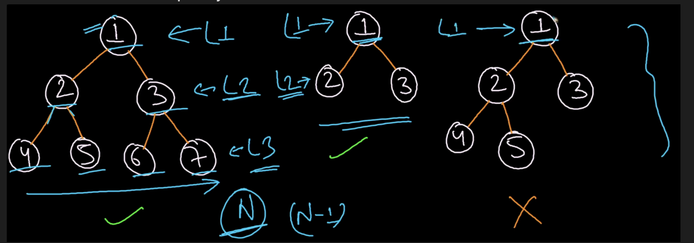
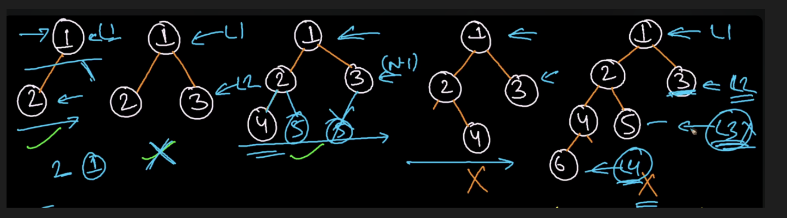
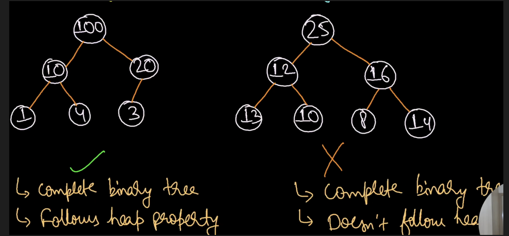
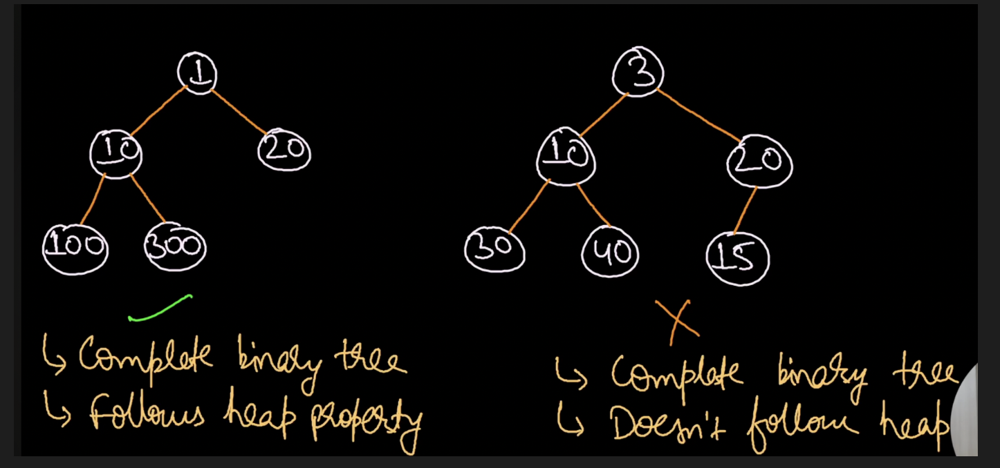

|                | Insert  | Search  | Find_minimum/Find_Maximum | Delete_minimun/Delete_Maximum |
| -------------- | ------- | ------- | ------------------------- | ----------------------------- |
| Unsorted Array | O(1)    | O(N)    | O(N)                      | O(N)                          |
| Sorted Array   | O(N)    | O(logN) | O(1)                      | O(N)                          |
| Linked List    | O(N)    | O(N)    | O(N)                      | O(N)                          |
| Min Heap       | O(logN) | O(N)    | O(logN)                   | O(logN)                       |

## Complete Binary Tree
1. Perfect Binary tree
2. Almost Complete Binary tree

Both perfect binary tree and almost complete binary tree falls under complete binary tree

## Perfect Binary Tree
All the levels will be completely filled


## Almost complete binary tree
1. Leaves should be present only at last and second last level
2. Leaves at the same level must be filled from left to right


## Heap data structure
- Tree based data structure
- Complete binary tree
- We can have n-ary heap as well
- Follows heap property
- Types: (i)Min Heap (ii)Max Heap

### Max Heap
It is complete binary tree in which root should always be maximum and same goes for all subtrees

### Min Heap
It is complete binary tree in which root should always be minimum and same goes for all subtrees



## Representation of Heap
- Parent at index `i` then left child index `2i+1` right child index `2i+2` (0-based indexing)
- Child at index `i` then parent at `ceil(i/2)-1`
- Heap is a complete binary tree and can be stored in an array
- Maximum array size is `(2^(h+1)-1)` for a perfect binary tree
- Maximum nodes at height h `2^h`
- Maximum nodes in entire tree of height h is `(2^(h+1)-1)` for perfect binary tree
- Range of leaves `floor(N/2)+1 to N` (for 1 based indexing)
- Range of leaves `floor(N/2) to (N-1)` (for 0 based indexing)
- Range of internal nodes `1 to floor(N/2)` (for 1 based indexing)
- Range of internal nodes `0 to floor(N/2)-1` (for 0 based indexing)

## Heap property
Max Heap: Root node should be greater than all left and right subtree nodes and it is recursively true for all subtrees

A leaf node always follows heap property


## Heapify algorithm
The process of rearranging the heap by comparing each parent with its children recursively is known as Heapify

```go
MAX_HEAPIFY(A,i)
{
	L=2*i+1
	R=2*i+2
	if(L<=A.heap_size and A[L]>A[i]){
		largest=L
	}else largest=i
	
	if(R<=A.heap_size and A[R]>A[largest]){
		largest=R
	}
	
	if(largest!=i){
		swap(A[i],A[largest])
		Max_HEAPIFY(A,largest)
	}
}
```


#### Time Complexity

**`siftDown` alone** — a single call at index `i` travels at most the height of that subtree. In the worst case (called at root), that's **O(log n)**.

**`BuildHeap` — the naive guess is O(n log n)** — you call `siftDown` roughly `n/2` times, each costing O(log n). But this is **too pessimistic**.

The insight is that most nodes are near the **bottom of the tree**, where sift-down is cheap:

|Level from bottom|Nodes at this level|Max sift-down cost|
|---|---|---|
|0 (leaves)|n/2|0|
|1|n/4|1|
|2|n/8|2|
|...|...|...|
|log n (root)|1|log n|

Total work = `n/4 × 1 + n/8 × 2 + n/16 × 3 + ...`

This sum converges to **O(n)** — which is why `BuildHeap` is O(n), not O(n log n). The majority of nodes sit at the bottom levels and barely move.


